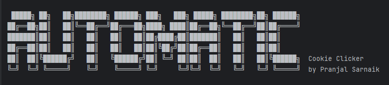
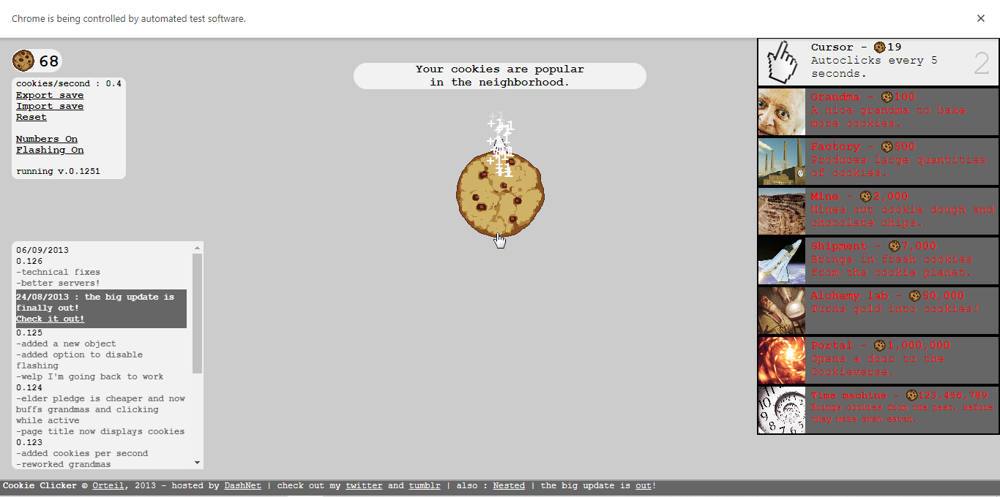
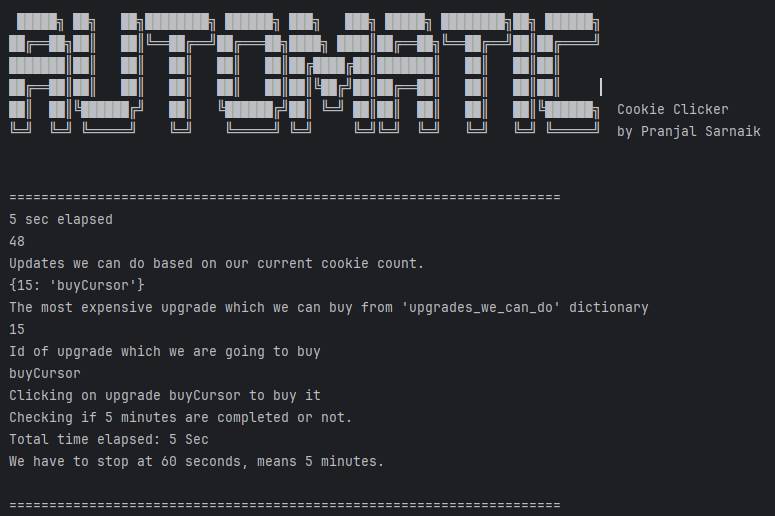
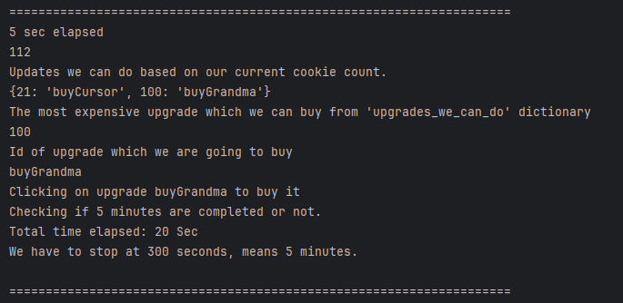

# Automatic Cookie Clicker Bot
This project is a **Selenium-based game bot** that automates gameplay for **Cookie Clicker**. It continuously clicks the cookie, evaluates upgrades every 5 seconds, and prioritizes the most expensive one to maximize performance. The bot stops after 5 minutes and displays the cookies-per-second rate.  

## Screenshots
, , , 

## Author
Pranjal Sarnaik

## Features
- Automates cookie clicking.  
- Buys the most expensive upgrade every 5 seconds.  
- Runs for 5 minutes and tracks performance.  
- Uses **Selenium** to interact with the game webpage.  

## Level
Intermediate

## Tech Stack
Python | Selenium | Automation | Game Bot Development  

## How to Run
1. Clone the repo:  
   ```bash  
   git clone https://github.com/pranjalco/automatic-cookie-clicker-bot.git

2. Run(Also install required libraries):
    ```bash
   pip install selenium
   python app.py

**Created by Pranjal Sarnaik**  
*Released under the MIT License*